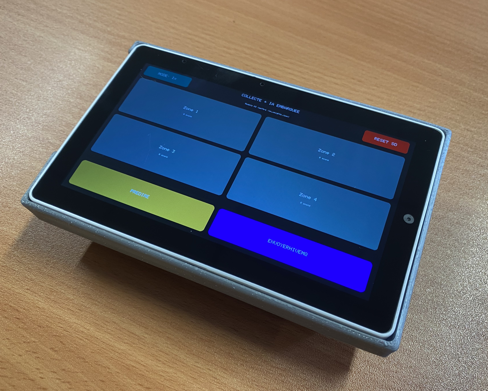
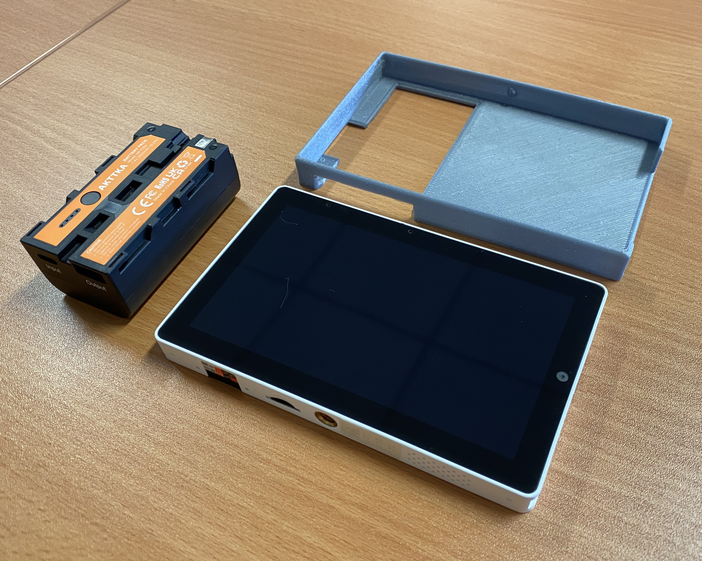
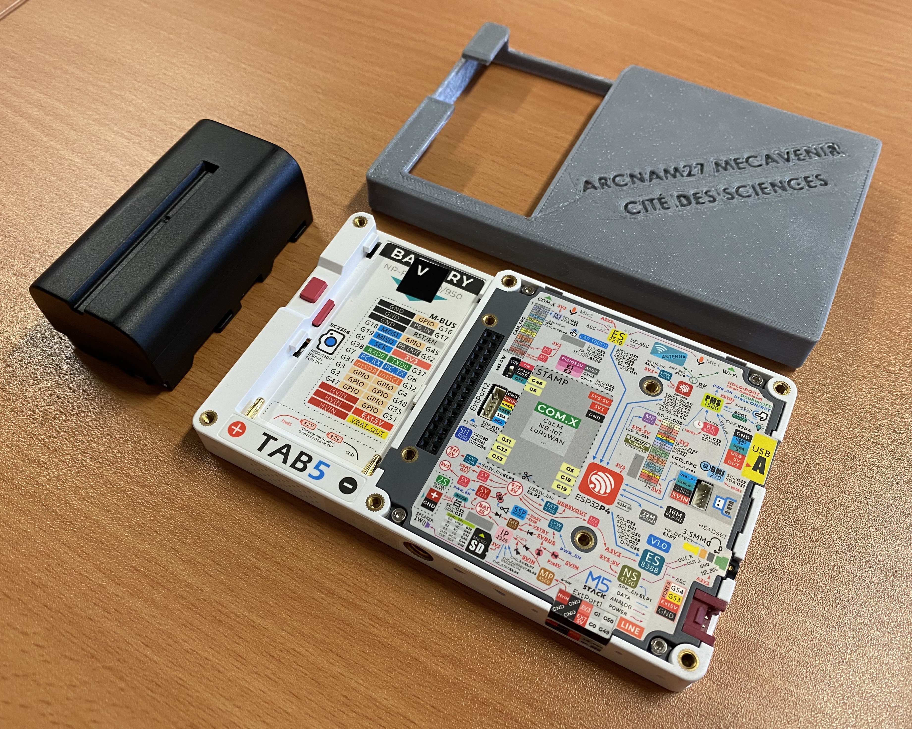
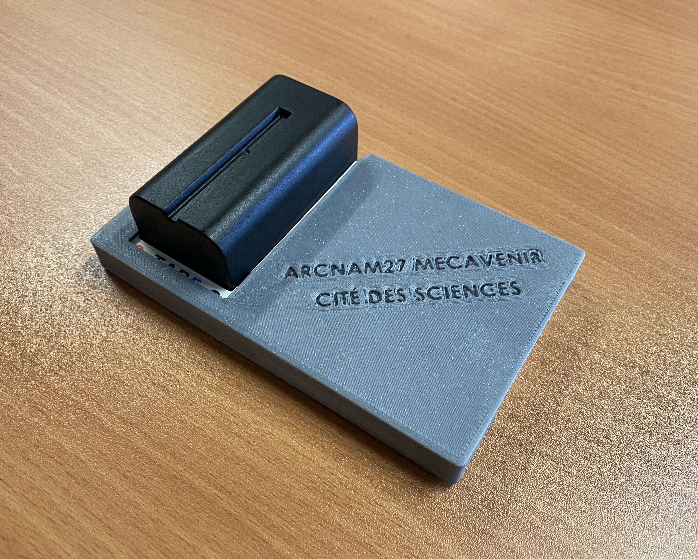

[](https://www.gnu.org/licenses/gpl-3.0)


# W.I.N.G.S – WiFi Indoor Neural Guidance System

### Smart Indoor Positioning using WiFi Fingerprinting and Edge AI

---

## Project Overview

W.I.N.G.S is a real-time indoor positioning system based on WiFi fingerprinting and embedded neural network inference.

The system allows an ESP32-based tablet (M5Stack Tab5) to determine its position inside an indoor environment and display contextual information depending on the detected zone.

Unlike GPS-based geolocation, this project relies entirely on WiFi signal strength (RSSI) and Edge AI computation.

---

## System Architecture

The complete pipeline is composed of:

- A WiFi Data Collector (ESP32 / Tab5)
- MQTT communication
- Neural network training (Google Colab)
- Exported trained weights (.json)
- Embedded inference on the device
- Interactive museum-style guidance interface

---

## Repository Architecture

```
WINGS/
├── README.md
├── firmware/
│   ├── data_collection_tab5_MACv4_V5_Stable.ino    -->    WiFi RSSI acquisition and MQTT transmission firmware.
│   └── guide_musee_tab5_V1_stable.ino    -->    Real-time indoor positioning and contextual display firmware.
├── firmware_tests/
│   └── Programme_lecture_json.ino    -->    Utility program used to validate JSON weight loading and parsing.
├── datasets/    -->    Raw WiFi fingerprint datasets used for neural network training.
│   ├── Zone_1_v2.csv
│   └── Zone_2_v2.csv
├── training/
│   └── WiFi_Indoor_Geolocation_Training_MQTT.ipynb    -->    Neural network training notebook (Google Colab).
├── nn_weights.json    -->    Trained neural network parameters.
├── mac_addresses_treasure.json    -->    Ordered WiFi Access Point reference list.
└── images/
      └── System diagrams and device pictures.
```

---

## System Workflow

1. The Data Collector scans nearby WiFi Access Points.
2. RSSI values are filtered according to a predefined MAC address list.
3. Data is sent via MQTT.
4. The dataset is processed and used to train a neural network in Google Colab.
5. Trained weights are exported to `nn_weights.json`.
6. The Museum Guide firmware loads the weights.
7. The device performs real-time inference.
8. An image and contextual information are displayed according to the detected zone.

---

## Neural Network Model

The model is a feed-forward neural network:

- Input size: 10 RSSI values  
- Hidden layer: 16 neurons  
- Output size: 4 zones  

Training dataset:

- 333 training samples  
- 84 test samples  
- ~86.9% accuracy  

Inference is performed directly on the ESP32 (Edge AI, no cloud required after training).

---

## Dataset Structure

The datasets located in the `/datasets` directory contain structured WiFi RSSI fingerprints.  

Each CSV file corresponds to a labeled zone and includes:  

- Ordered RSSI values  
- Predefined MAC address mapping  
- Zone label  

These datasets are used as input for neural network training in the Colab notebook.

---

## JSON Validation Tool

The `Programme_lecture_json.ino` firmware is a utility program used to:  

- Test JSON parsing on ESP32  
- Validate weight loading from `nn_weights.json`  
- Debug SD card reading issues  

This program ensured correct embedded inference implementation before deploying the final museum guide firmware.

---

# Data Collector – Detailed Explanation

## Purpose

The Data Collector firmware (`data_collection_tab5_MACv4_V5_Stable.ino`) is responsible for building the WiFi fingerprint dataset used for training the neural network.

It scans surrounding WiFi networks and extracts RSSI values from a predefined list of MAC addresses.

This predefined list is referred to as the “Treasure of War”, representing the selected Access Points used as spatial references.

---

## How It Works

1. The device performs a WiFi scan.
2. It filters detected networks using the predefined MAC address list.
3. RSSI values are ordered according to a fixed AP order.
4. Missing APs are assigned a default low RSSI value.
5. The structured vector is sent via MQTT.
6. Data is manually labeled depending on the current zone.

Each zone requires multiple scans to reduce signal instability.

---

## Why Multiple Scans?

WiFi RSSI is highly unstable due to:

- Multipath propagation
- Human movement
- Interference
- Device orientation
- Environmental changes

To reduce noise and increase robustness, a 50-scan acquisition mode was implemented.

---

# Data Collector – Version History

## V1 – Initial WiFi Scanner

- Basic WiFi RSSI acquisition
- Serial monitor output only
- Manual signal observation

## V2 – Structured MAC Filtering

- Introduction of predefined MAC address list
- Ordered RSSI vector construction
- Default value handling for missing APs

## V3 – MQTT Integration

- Added MQTT communication
- Automatic data transmission to Colab
- Zone labeling integration

## V4 – Multi-Scan Stability Mode

- Introduction of multi-scan acquisition
- Averaging strategy to reduce RSSI noise
- Improved timing control

## V5 – Stable Training-Compatible Release

- 50-scan mode
- Stable MQTT transmission
- Fully compatible with neural network training pipeline

---

# Museum Guide – Real-Time Inference

The Museum Guide firmware (`guide_musee_tab5_V1_stable.ino`) performs real-time indoor positioning.

It:

1. Loads neural network weights from `nn_weights.json`
2. Performs real-time WiFi scans
3. Normalizes input values
4. Executes forward propagation
5. Determines the most probable zone
6. Displays contextual information

The system operates entirely locally once trained.

---

## Troubleshooting & Problems Encountered

- RSSI instability → Multi-scan averaging strategy  
- MQTT data loss → Adjusted sending frequency  
- SD card mount issues → Manual SPI initialization  
- Model overfitting → Input normalization + tuning  

---

## Physical Device

The system runs on an M5Stack Tab5 (ESP32-based tablet).

A thin custom 3D-printed ABS protective shell was designed to protect the device during data collection sessions.  
  
  
    
  

---

## Authors

- A. Dantan  
- A. Achiaou  
- W. Heddi  

---

## License

This project is licensed under the GNU General Public License v3.0 (GPL v3).
